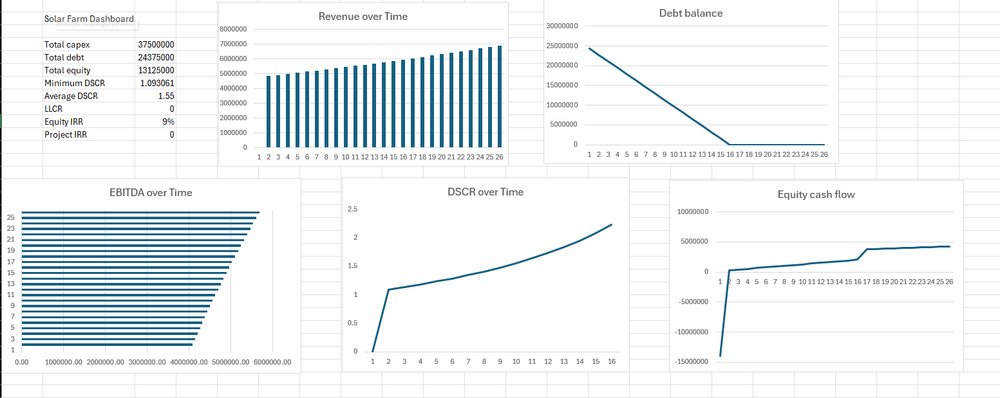
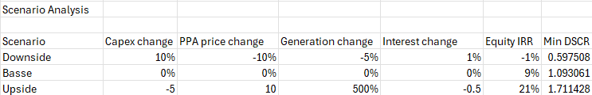

# ☀️ Solar Farm Project Finance Model

An **infrastructure finance and financial modelling project** that evaluates a simplified **50 MW solar farm** using an Excel-based project finance model.  
It demonstrates **cash flow forecasting**, **debt analysis**, **coverage ratio testing**, **scenario analysis**, and **investor return assessment** — finished with lender and investor-ready outputs.  

---

## 🚀 What This Project Does  

- ⚡ **Models a 50 MW solar farm** over a 25-year project life  
- 🏗️ **Forecasts construction costs** and funding from debt and equity  
- ☀️ **Projects solar generation** using capacity factor and annual degradation  
- 💷 **Calculates revenue** from electricity sales under a long-term PPA-style tariff  
- 📉 **Builds a debt schedule** with interest, principal repayment, and closing balance  
- 🧮 **Calculates key project finance metrics** including CFADS, DSCR, LLCR, project IRR, and equity IRR  
- 📊 **Tests downside, base, and upside cases** for generation, pricing, capex, and interest rates  
- 📈 **Produces dashboard outputs** for project returns, debt repayment, and lender risk  

---

## 🧰 Tech Stack  

- **Financial Modelling**: Microsoft Excel  
- **Analysis**: Scenario analysis, debt sizing, sensitivity testing  
- **Core Finance Metrics**: CFADS, DSCR, LLCR, project IRR, equity IRR  
- **Visualisation**: Excel charts and dashboard outputs  
- **Documentation**: Markdown README and PDF investment summary  

---

## 📁 Repository Structure  

```text
solar-farm-project-finance/
├── README.md                                  # Project overview (this file)
├── model/
│   ├── solar_farm_project_finance_model.xlsx  # Base case model
│   ├── solar_downside_case.xlsx               # Downside scenario
│   └── solar_upside_case.xlsx                 # Upside scenario
├── report/
│   └── solar_farm_investment_summary.pdf      # Short investment summary
├── outputs/
│   ├── dashboard_screenshot.png               # Model dashboard
│   └── sensitivity_table.png                  # Scenario analysis output
└── notes/
    └── assumptions_sources.md                 # Assumption notes and references
```

---

## ▶️ How to Use the Model  

### 1. Open the base case workbook  

Open:

```text
model/solar_farm_project_finance_model.xlsx
```

---

### 2. Review the input assumptions  

Go to the **`01 Inputs`** tab and review the key assumptions:

- Project life  
- Construction period  
- Capacity in MW  
- Capex per MW  
- Capacity factor  
- Annual degradation  
- PPA price and escalation  
- Opex per MW  
- Debt percentage  
- Interest rate  
- Debt tenor  
- Tax rate  

---

### 3. Follow the model flow  

The workbook is structured so the model moves from assumptions to outputs:

```text
Inputs → Timeline → Construction → Operations → Debt → Tax → Cash Flow → Returns → Dashboard
```

This shows how project assumptions flow through to lender and investor returns.

---

### 4. Review the key outputs  

The **`10 Dashboard`** tab summarises:

- Total capex  
- Total debt  
- Total equity  
- Minimum DSCR  
- Average DSCR  
- LLCR  
- Project IRR  
- Equity IRR  

---

### 5. Compare scenario cases  

Open the three case files:

```text
solar_farm_project_finance_model.xlsx
solar_downside_case.xlsx
solar_upside_case.xlsx
```

The model compares how returns and debt coverage change under:

- Lower generation  
- Lower electricity prices  
- Higher capex  
- Higher interest rates  

---

## 🧱 Workbook Structure  

| Tab | Purpose |
|---|---|
| `00 Cover` | Front page with project summary and headline outputs |
| `01 Inputs` | Key assumptions for the solar farm model |
| `02 Timeline` | Year structure, construction flag, operations flag, and debt repayment flag |
| `03 Construction` | Capex spend, debt drawdown, and equity contribution |
| `04 Operations` | Generation, revenue, opex, and EBITDA forecast |
| `05 Debt` | Opening debt, interest, principal repayment, and closing debt |
| `06 Tax` | Simplified taxable income and tax calculation |
| `07 Cash Flow` | CFADS, debt service, cash after debt, and equity cash flow |
| `08 Returns` | DSCR, LLCR, project IRR, and equity IRR |
| `09 Sensitivities` | Downside, base, and upside cases |
| `10 Dashboard` | Summary outputs and charts |
| `11 Checks` | Model integrity checks |

---

## 📊 Example Outputs  

**Dashboard Summary**  
  

**Scenario Analysis**  
  

---

## 🎯 Why This Project Matters  

This project showcases **core infrastructure finance modelling**:  

- **Project finance logic** built around asset cash flows rather than general corporate earnings  
- **Debt service analysis** using CFADS, DSCR, and LLCR  
- **Lender risk assessment** through repayment coverage and downside testing  
- **Investor return analysis** using project IRR and equity IRR  
- **Renewable infrastructure modelling** with generation, tariff escalation, degradation, and opex assumptions  
- **Scenario analysis** to test how the project performs when key assumptions change  

---

## 🔒 Notes  

- The model is **simplified for learning and portfolio use**  
- It does **not** include full depreciation schedules, reserve accounts, refinancing, detailed tax treatment, or legal documentation  
- The base model uses **conventional project finance debt** for learning purposes  
- A future extension could compare the model with a **sukuk-style asset-backed financing structure**  
- Extend project: add debt sculpting, DSRA, PLCR, two-way data tables, or a Power BI dashboard  
